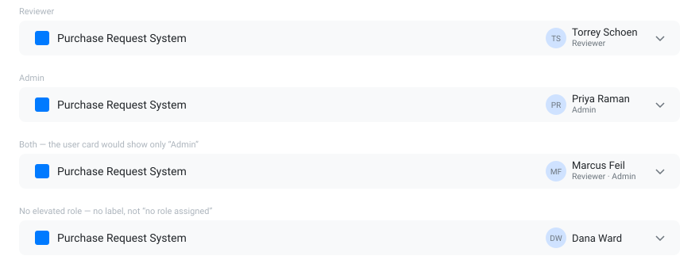

# S1-A — Show the signed-in user's roles in the header

**Type:** Feature

Nothing in the app tells you what you're allowed to do. Show the signed-in user's roles in the
header, beneath their name.

- `Reviewer`, `Admin`, or `Reviewer · Admin` when both apply.
- Someone with neither role gets **no label at all**.

## Acceptance criteria

- [ ] A reviewer sees `Reviewer` beneath their name in the header
- [ ] An admin sees `Admin`
- [ ] Someone with both flags sees **both**, separated by a middot
- [ ] Someone with neither sees **nothing** — not `no role assigned`
- [ ] Signed out, the header still shows the **Sign in** button and no label
