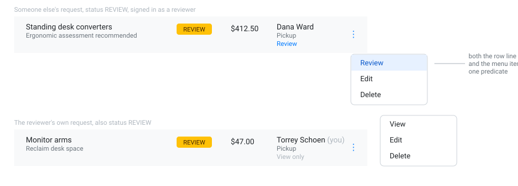

# S1-B — Honest review permission, and the row action wording

**Type:** Feature

Every row's three-dots menu says **Review**, whether or not you can review that request. Make
the wording tell the truth, and make the permission real.

- Introduce one predicate: you can review a request when you're a reviewer, it isn't yours, and
  its status is `REVIEW`.
- Each row shows **Review** or **View only** on its own line, beneath the requester and the
  delivery mode — so a reviewer scanning the list can see what's actionable without opening
  anything.
- The first item in the row's ⋮ dropdown reads **Review** or **View** to match.
- The detail page's Approve and Reject buttons honour the same predicate.

## Acceptance criteria

- [ ] Each row shows **Review** when the signed-in user could actually review that request, and
      **View only** otherwise
- [ ] The requester's name and the **delivery mode** are still both there — the new line is
      added beneath them, not in place of anything
- [ ] The first item in the row's ⋮ dropdown agrees with the row: **Review** or **View**
- [ ] A non-reviewer never gets enabled Approve or Reject buttons
- [ ] A reviewer still cannot approve or reject their own request — buttons disabled, warning
      shown
- [ ] The warning says which rule applies: not yours to review, versus you aren't a reviewer
- [ ] Verified signed in as a reviewer **and** as a non-reviewer

> **Note:** this is UI honesty, not a security boundary. The API stays open by design in this
> course — don't add `[Authorize]`.
