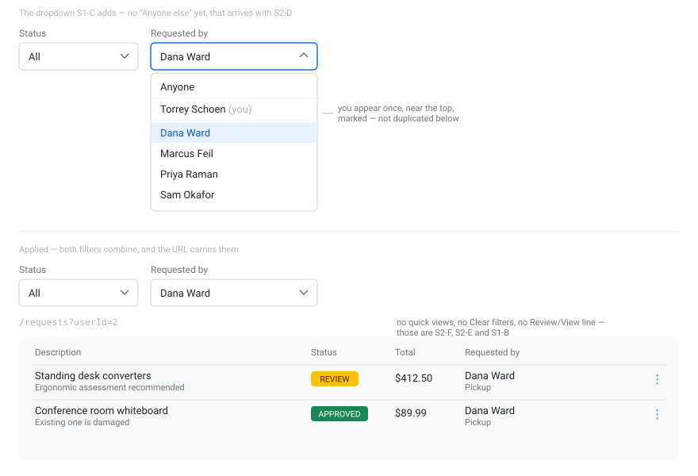

# S1-C — Filter the requests list by requester

**Type:** Feature

The requests list filters by status only. With fifty requests, finding one person's is a manual
scan.

- A **Requested by** dropdown beside the existing Status filter.
- Options: `Anyone`, then the signed-in user's own name marked `(you)`, then everyone else.
- Filtering happens **server-side**, like the status filter already does.
- The selection lives in the URL, so it survives a refresh and combines with `status`.

## Acceptance criteria

- [ ] A **Requested by** dropdown appears beside the Status filter
- [ ] Selecting a person narrows the table to that person's requests
- [ ] The signed-in user appears **once**, near the top, marked `(you)`
- [ ] Status and Requested by combine
- [ ] Refreshing the page preserves both
- [ ] The list is **not** filtered on arrival — `Anyone` is the starting state
- [ ] `GET /api/requests` still behaves **exactly as before** when no requester is specified
- [ ] Verified in Insomnia and in the browser
