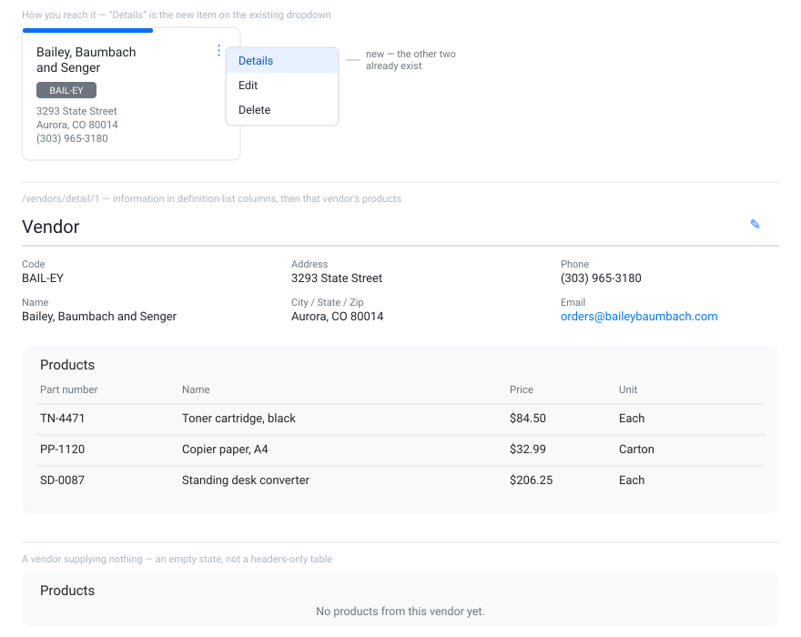

# S1-D — Vendor detail page

**Type:** Feature · **Unassigned — the first student to finish Sprint 1 pulls this**

There's no way to see what a vendor supplies. Add a read-only vendor page showing the vendor's
information and every product they supply.

- New route `/vendors/detail/:id`, reached from a **Details** item added to the existing
  three-dots dropdown on the vendor card.
- Vendor code, name, address, city/state/zip, phone and email.
- Below that, a table of that vendor's products: part number, name, price, unit.

## Acceptance criteria

- [ ] `/vendors/detail/:id` renders the vendor's information and that vendor's products
- [ ] A **Details** option appears in the vendor card's three-dots dropdown, above the existing
      Edit and Delete
- [ ] A vendor supplying no products shows an **empty-state message**, not a headers-only table
- [ ] `GET /api/vendors/{id}` returns the vendor with its products included
- [ ] **`Add-Migration` produces an empty migration** — adding the inverse navigation property
      to an existing foreign key changes no columns
- [ ] Verified in Insomnia and in the browser
