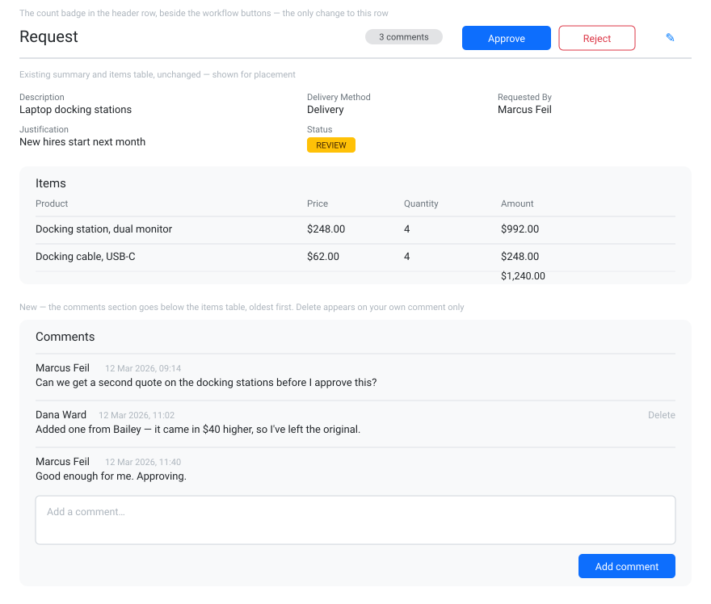

# S2-A — Comments on a request

**Type:** Feature · **Schema change — database schema owner only**

Reviewers and requesters currently have no way to discuss a request in the system.

- New `Comment` entity: id, body (max 500, required), the request it belongs to, the user
  who wrote it, and the date/time it was created.
- Comments appear on the request detail page below the items table, oldest first, each
  showing author name and timestamp.
- A textarea and **Add comment** button post a new comment as the signed-in user.
- A comment count badge appears in the request detail page's header row, beside the
  workflow buttons.

## Acceptance criteria

- [ ] `Comment` model, `DbSet`, and migration applied
- [ ] `GET /api/comments?requestId={id}`, `POST /api/comments`, `DELETE /api/comments/{id}`
      follow the project's existing controller conventions and response codes
- [ ] Comments render on `/requests/detail/:id` with author and timestamp
- [ ] Adding a comment shows it without a page reload and raises the header count
- [ ] A comment's author can delete their own comment; others cannot
- [ ] Verified in Insomnia and in the browser
