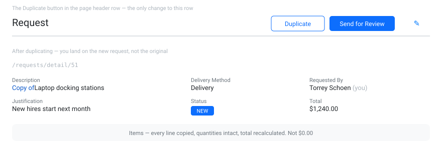

# S2-B — Duplicate a request

**Type:** Feature

Users re-submit similar requests month to month and re-enter every line by hand.

- A **Duplicate** button on the request detail page header row.
- Duplicating creates a new request with the same description (prefixed `Copy of `),
  justification, and delivery mode; status `NEW`; owned by the signed-in user; with a copy
  of every line item.
- On success, navigate to the new request's detail page.

## Acceptance criteria

- [ ] `POST /api/requests/{id}/duplicate` returns the new request (201)
- [ ] The new request has the same line items, quantities, and a correctly calculated total
- [ ] Its description is the original's, prefixed `Copy of `
- [ ] Its status is `NEW` regardless of the original's status
- [ ] The original request is unchanged
- [ ] Verified in Insomnia and in the browser
