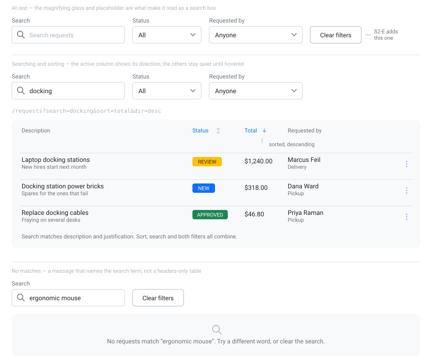

# S2-C — Search and sort the requests list

**Type:** Feature

The requests list only filters by status. With fifty requests it's hard to find anything.

- A search box above the requests table filtering on description and justification.
- Sortable **Total** and **Status** columns (click to toggle ascending/descending).
- Search and sort combine with the existing status filter, and survive a page refresh
  (they live in the URL query string like `status` already does).

## Acceptance criteria

- [ ] Typing in the search box narrows the table
- [ ] Clicking Total or Status sorts, and clicking again reverses
- [ ] Search, sort, and status filter work together
- [ ] Refreshing the page preserves all three
- [ ] `GET /api/requests` still behaves exactly as before when no new parameters are sent
