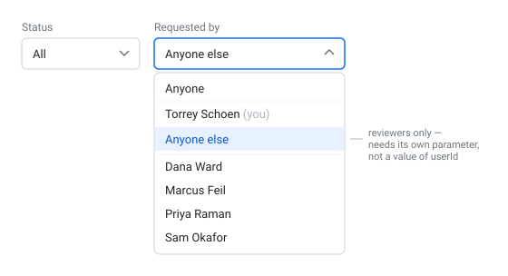

# S2-D — "Anyone else": the reviewer's counter-filter

**Type:** Feature · **depends on S1-C**

A reviewer's job is other people's requests. The **Requested by** filter can pick one person; it
can't yet say *not me*.

- An **Anyone else** option in the Requested by dropdown, **shown only to reviewers**.
- Selecting it shows every request except the signed-in user's own.

## Acceptance criteria

- [ ] **Anyone else** appears in Requested by for a reviewer, and is absent for everyone else
- [ ] Selecting it shows every request except the signed-in user's
- [ ] `GET /api/requests?excludeUserId=3` returns everything except user 3's requests
- [ ] Sending both a requester **and** an excluded requester behaves in a documented way — you
      choose the behaviour, and the pull request says what you chose and why
- [ ] `GET /api/requests` with neither is still unchanged
- [ ] Verified in Insomnia
