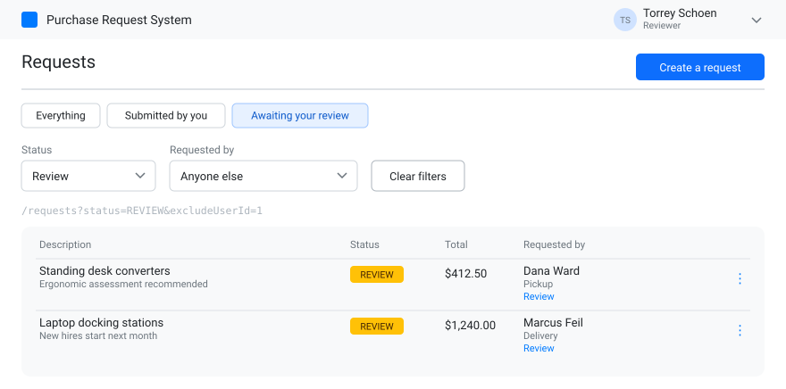

# S2-F — Quick views

**Type:** Feature · **depends on S1-C and S2-D**

Three named starting points above the filters, so the combinations people actually want are one
click instead of two dropdowns.

- **Everything**, **Submitted by you**, and **Awaiting your review**.
- The last one is the reviewer queue: status `REVIEW`, requested by anyone else. Reviewers only.
- Clicking one sets the dropdowns; the dropdowns stay the source of truth.

## Acceptance criteria

- [ ] Three buttons sit above the filters; **Awaiting your review** appears only for reviewers
- [ ] Clicking one visibly updates both dropdowns **and** the URL
- [ ] **Awaiting your review** excludes the reviewer's own `REVIEW` requests
- [ ] Changing a dropdown by hand deselects the quick view without changing what's listed
- [ ] The queue's empty state reads as "nothing is waiting on you", not as an error
